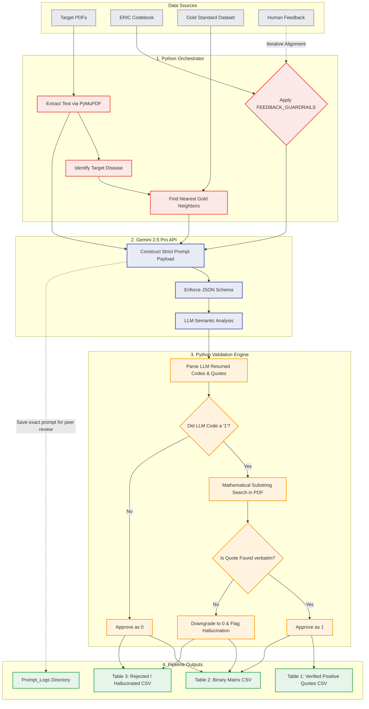

# Architecture and Methodology: Automated Implementation Strategy Coder
**Date:** March 2026
**Framework:** Python Data Pipeline with Gemini API structured integration

## 1. Problem Statement
Previous attempts to classify research papers against the 73 ERIC Implementation Strategies using conversational AI interfaces (like standard Gemini or NotebookLM) failed due to several inherent limitations of Generative AI:
*   **Numerical & Sequence Drifting:** The LLM would lose track of which of the 73 strategies it was analyzing.
*   **Definition Hallucination:** The LLM would default to its internal, generalized knowledge of the ERIC taxonomy rather than strictly adhering to the user-provided "Codebook."
*   **Quote Hallucination:** When asked to provide textual evidence for a '1' coding, the LLM would occasionally invent a quote that sounded plausible but did not exist in the source text.
*   **Neighborhood Rule Failure:** Conversational AI struggles with complex relational lookups (e.g., finding identical disease/author pairings across 70 Gold Standard CSV files and applying their specific sensitivity thresholds).

## 2. Overview of the Python Data Pipeline
To establish a fundamentally transparent and academically defensible protocol, this project abandons "Chat Windows" and implements an **Enterprise Data Pipeline**. 

By orchestrating the Google Gemini API through Python, we put the LLM in a cognitive "straightjacket." Python handles the relational logic (Neighborhood rule) and mathematical verification (Quote Hallucination), while the LLM is restricted to performing only Semantic Extraction.

## 3. The 5-Step Pipeline Logic

### Step 1: Deterministic Data Loading (`data_loader.py`)
Instead of pasting the Codebook into a prompt, Python loads `Imp strategy codebook_updated 3-12-26.csv` via pandas. This is the **Absolute Source of Truth**. The LLM is only ever fed definitions directly from this CSV object, mathematically preventing it from using outside knowledge.

### Step 2: Algorithmic Neighborhood Matching
For every Target Paper, Python extracts the first page and uses a structured LLM call to identify the Target Disease. Python then executes a programmatic dataframe search across the Gold Standard dataset (`imp_strat_final_sort of + clearly2.csv`). 
*   It scores the 70 Gold Standard papers (+2 points for exact Disease match, +1 point for exact Author match).
*   It passes the top 3 closest Gold Standard neighbors directly into the LLM context window as the baseline for the "Neighborhood Rule."

### Step 3: Localized PDF Extraction (`pdf_extractor.py`)
Target PDFs are parsed locally. This ensures we control exactly what text the LLM "sees" and have a raw string against which we can perform mathematical verification later.

### Step 4: Structured LLM Output Constraint (`llm_client.py`)
We leverage `pydantic` json-schemas to force the Gemini API to return a rigid JSON object for every coding. 
*   `Strategy_ID`: Must perfectly match the codebook.
*   `Value_Coded`: Must be an integer 0 or 1.
*   `Quote_Text`: The textual evidence.
*   `Rationale`: A 1-sentence justification.
Because the LLM must conform to the JSON interface, "Numerical Drifting" where it misses strategies is physically impossible.

### Step 5: Mathematical Quote Verification - Zero Hallucination (`verifier.py`)
This is the most critical guardrail for reproducibility.
When the LLM returns a `1` with a `Quote_Text`, Python executes a literal substring search: `Quote_Text in Extracted_PDF_Text`. 
*   If the LLM slightly altered the quote, hallucinates words, or generates synthetic text, the Python substring search fails.
*   Upon failure, Python logs a "HALLUCINATION REJECTED" warning and programmatically downgrades the classification to `0`. 
*   **Therefore, every `1` appearing in the final Output CSV is mathematically guaranteed to be accompanied by a verbatim quote that physically exists in the original PDF file.**

## 4. Traceability and the Output Tables
Because of the design of this pipeline, the outputs are mathematically transparent:

1. **`Output_Table_2_Binary_Matrix.csv`**: The master dataset used for statistical analysis. It shows the presence (1) or absence (0) of every strategy across every paper.
2. **`Output_Table_1_Quotes.csv`**: The positive audit trail. If a 1 appears in Table 2, this table contains the exact physical sentence from the corresponding PDF asserting the strategy's usage.
3. **`Output_Table_3_Rejected.csv`**: The negative audit trail. For every 0 appearing in Table 2, this table explicitly logs *why* the strategy was rejected (e.g. "No evidence in text" or "[REJECTED DUE TO HALLUCINATION]").

Any researcher can take the string found in the "Textual Evidence" column of Table 1, open the corresponding Target PDF, and hit `Ctrl+F` to find the exact justification for the coding. There are no black boxes.

## 5. Enhancements for Scientific Publication
To ensure this methodology survives peer-review, three critical transparency guardrails were embedded in the pipeline:

### A. The Confidence Score
The LLM natively outputs a `Confidence_Score` (1-5) alongside every coding. This reflects the model's internal certainty regarding the match against the ERIC Codebook. Lower scores on accepted matches highlight edge cases suitable for human secondary review.

### B. Explicit Verification Status
Instead of just a "0" or "1", every single coding output (Tables 1 and 3) carries a `Verification_Status`:
*   `Verified_Match`: The LLM coded a 1 and the exact textual quote was successfully located in the PDF.
*   `LLM_Determined_Absent`: The LLM correctly identified no evidence existed and coded a 0.
*   `System_Rejected_Hallucination`: The LLM attempted to code a 1, but the mathematical substring search failed. The Python Orchestrator intervened, forced the value to 0, and threw out the fabricated quote.

### C. System Prompt Auditing
In AI research, the specific prompt payload passed to an LLM acts as the study's "Methods" section. The pipeline automatically writes every single individual prompt passed to Gemini (which includes the specific Codebook slices and the specific Neighborhood Baseline context) into text files located in `Outputs/Prompt_Logs/`. These files serve as perfect supplementary material for a journal submission.

## 6. Pipeline Architecture Visual Map
Below is the technical flowchart demonstrating how the Python Orchestrator strictly controls the LLM API. 
*(Note: If you are viewing this file in VS Code or GitHub, this diagram will render automatically. You can also paste this block into [Mermaid Live Editor](https://mermaid.live) to generate a PNG).*

