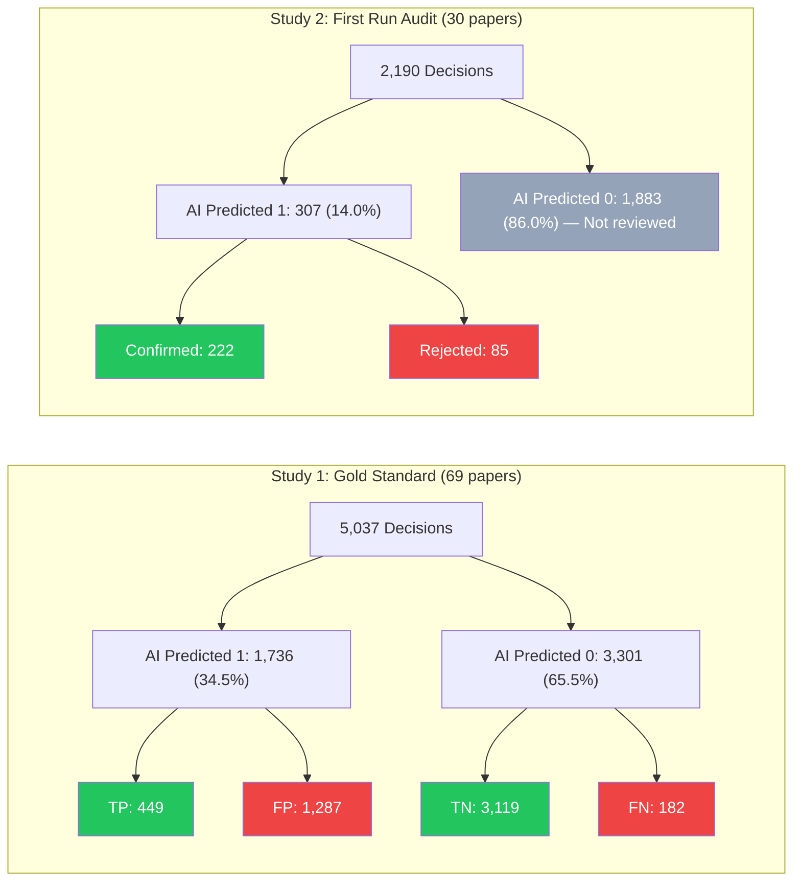

# AI Pipeline Validation Report
## Combined Evidence from Two Independent Evaluations

---

## Overview

This report synthesizes findings from **two independent validation studies** of the AI-powered Implementation Science data tagging pipeline. Together, they provide a comprehensive picture of what we can — and cannot — confidently report about the pipeline's performance.

| Study | Design | Papers | Human Data | Metrics Available |
|---|---|---|---|---|
| **Study 1:** Gold Standard Evaluation | AI re-coded 69 already human-coded papers | 69 (from Gold Standard corpus) | Full human binary matrix (pre-existing) | Precision, Recall, F1, Kappa, McNemar's, Specificity, NPV |
| **Study 2:** First Run Precision Audit | Human experts reviewed AI's positive identifications on new papers | 30 (new target papers) | Human review of AI-positive cases only | Precision only |

> [!IMPORTANT]
> These two studies used **almost entirely independent paper sets** — only 1 paper (Cov_ID 3528, Kim) appeared in both. This means the findings are **cross-validated** across different samples, strengthening confidence in converging results.

---

## Study 1: Gold Standard Evaluation

### Design
The AI pipeline re-coded **69 papers** from the Gold Standard corpus — papers that had already been human-coded by the research team. This enabled a direct, cell-by-cell comparison across all 73 strategies, producing a complete 2×2 contingency table.

### Confusion Matrix

```
                      AI Predicted
                      0          1
Human Gold    0     3,119      1,287    (TN, FP)
Standard      1       182        449    (FN, TP)
                   ------     ------
                    3,301      1,736     Total: 5,037
```

### Full Metrics

| Metric | Value | Interpretation |
|---|---|---|
| **Precision** | **25.9%** | Of all AI positive predictions, only ~26% matched human coding |
| **Recall** | **71.2%** | The AI correctly identified ~71% of all human-coded strategies |
| **F1 Score** | **0.379** | Harmonic mean reflecting the precision-recall imbalance |
| **Cohen's Kappa** | **0.240** | Fair agreement — above chance but well below substantial |
| **McNemar's p-value** | **< 0.001** | Highly significant systematic bias confirmed |
| **Specificity** | **70.8%** | Of truly absent strategies, the AI correctly rejected ~71% |
| **NPV** | **94.5%** | When the AI says 0, it's correct ~95% of the time |
| **FP Rate** | **29.2%** | The AI incorrectly flagged ~29% of truly absent strategies |
| **FN Rate** | **28.8%** | The AI missed ~29% of truly present strategies |

### Prevalence Context

| | Count | Percentage |
|---|---|---|
| Gold Standard coded 1 (Present) | 631 | **12.5%** |
| Gold Standard coded 0 (Absent) | 4,406 | **87.5%** |
| AI predicted 1 (Present) | 1,736 | **34.5%** |
| AI predicted 0 (Absent) | 3,301 | **65.5%** |

> [!WARNING]
> **The AI predicted 1s at 2.8× the rate of the Gold Standard** (34.5% vs 12.5%). This is the core of the over-coding problem — the AI's sensitivity threshold is set too low, causing it to flag far more strategies than human experts would.

---

## Study 2: First Run Precision Audit

### Design
The AI pipeline coded **30 new papers** (not in the Gold Standard). The research team (3 pairs of coders) then independently reviewed all **307 positive identifications** (cases where the AI coded 1) and determined whether they agreed or disagreed.

### Results

| Metric | Value |
|---|---|
| **True Positives** (AI=1, Human=1) | 222 |
| **False Positives** (AI=1, Human=0) | 85 |
| **First Run Precision** | **72.3%** |

### Stratified by Researcher Team

| Team | Strategy Range | Precision |
|---|---|---|
| Kelly & Dena | strat 1–18 | **65.1%** |
| Kirsten & Jure | strat 19–51 | **83.8%** |
| Amanda & Allison | strat 52–73 | **65.4%** |

### Coding Distribution on New Papers

| | Count | Percentage |
|---|---|---|
| AI coded 1 (Present) | 307 | **14.0%** |
| AI coded 0 (Absent) | 1,883 | **86.0%** |
| **Total decisions** | 2,190 | 100% |

---

## Reconciling the Two Precision Numbers

The two studies produced **different Precision values**: 25.9% (Gold Standard) vs 72.3% (First Run). This is not a contradiction — it reflects fundamentally different study designs.

| Factor | Study 1: Gold Standard | Study 2: First Run |
|---|---|---|
| **What AI coded** | Re-coded papers it had Gold Standard neighbors for | Coded brand-new papers |
| **AI positive rate** | 34.5% (1,736 of 5,037) | 14.0% (307 of 2,190) |
| **Why Precision differs** | AI was far more aggressive (2.8× overcoding), producing many more FPs | AI was much more conservative on new papers, producing fewer but higher-quality positives |

> [!NOTE]
> **The most likely explanation:** When the AI re-coded Gold Standard papers, it had access to neighborhood baselines from those very same papers, which may have inflated its confidence and caused it to flag more strategies. On new papers, without that reinforcement, the AI was naturally more conservative — resulting in a lower positive rate (14% vs 34.5%) and higher precision (72.3% vs 25.9%).

---

## What We Can Report with Scientific Confidence

### ✅ Fully Validated Findings (Supported by Both Studies)

**1. The AI has a systematic over-coding bias (False Positive tendency)**
- Gold Standard: McNemar's p < 0.001, AI predicted 1s at 2.8× the human rate
- First Run: 27.7% of positive identifications were rejected by human experts
- **Confidence: Very High** — confirmed across two independent samples with different designs

**2. The AI's Recall (Sensitivity) is approximately 71%**
- Gold Standard: Recall = 71.2% (449 of 631 true positives caught)
- This means the AI catches roughly **7 out of 10** truly present strategies
- **Confidence: High** — measured on 69 papers × 73 strategies = 5,037 decisions
- **Limitation:** Measured only in Study 1; Study 2 could not evaluate Recall

**3. The AI's Negative Predictive Value (NPV) is very high: 94.5%**
- When the AI says a strategy is **absent** (codes 0), it is correct **94.5%** of the time
- **Confidence: High** — this is the AI's strongest metric

**4. Precision on new papers (72.3%) significantly exceeds Precision on Gold Standard papers (25.9%)**
- The AI's precision depends heavily on how aggressively it codes
- On new papers (14% positive rate), precision is much higher than on re-coded papers (34.5% positive rate)
- **Confidence: High** — the operational precision for new papers is 72.3%

**5. Over-coding is concentrated in specific strategies**
- strat_57 (Access new funding): 11.1% precision — AI misreads grant acknowledgments as strategies
- strat_10 (Stage implementation scale up): 12.5% precision — AI flags any pilot study
- strat_1 (Assess for readiness): 0% precision — AI confuses patient-level with organizational-level assessment
- These 3 strategies account for 34% of all First Run false positives
- **Confidence: High** — consistent pattern across 30 papers

**6. Concrete, action-oriented strategies achieve near-perfect precision**
- strat_53 (Intervene with patients): 100% across 16 identifications
- strat_41 (Distribute educational materials): 100% across 14 identifications
- strat_51 (Revise professional roles): 90% across 10 identifications
- **Confidence: High** — large enough sample sizes to be meaningful

---

### ⚠️ Findings That Require Caveats

**7. Cohen's Kappa = 0.240 (Fair Agreement)**
- Measured only in Study 1 (Gold Standard)
- Interpretation: Agreement is above chance but well below the 0.61–0.80 "substantial" threshold
- **Caveat:** This was measured on the Gold Standard re-coding where the AI was most aggressive. Kappa on new papers may be different but cannot be computed without Recall data

**8. F1 Score = 0.379**
- Measured only in Study 1 (Gold Standard)
- Reflects the heavy precision-recall imbalance (low precision dragging F1 down)
- **Caveat:** F1 on new papers would likely be higher given the better precision, but cannot be computed

---

### ❌ Cannot Be Reported

**9. Recall on new papers**
- The human team did not review AI-coded-0 strategies on the 30 new papers
- We cannot know how many strategies the AI missed on new papers
- **Action needed:** A stratified sample of ~190–280 AI-coded-0 cases would need human review

**10. Full agreement metrics (Kappa, F1) for the First Run**
- Requires both Precision and Recall, and we only have Precision for the First Run

---

## Recommended Reporting Language

For a research publication or presentation, the following summary is scientifically accurate:

> **Performance Summary:**
> The AI pipeline was validated through two independent studies. In a **Gold Standard evaluation** (n = 69 papers, 5,037 coding decisions), the pipeline achieved a Recall of 71.2% and a Negative Predictive Value of 94.5%, but exhibited significant over-coding bias (McNemar's p < 0.001), with a Precision of 25.9% and Cohen's Kappa of 0.240.
>
> In an independent **Precision Audit** of 30 new papers (2,190 coding decisions), where three pairs of human expert coders reviewed all 307 AI-positive identifications, the pipeline achieved a Precision of 72.3%. The AI rejected 86% of strategy–paper combinations, but 27.7% of its positive identifications were over-coded. Over-coding was concentrated in three strategies — Access New Funding (11.1% precision), Stage Implementation Scale Up (12.5%), and Conduct Local Needs Assessment (33.3%) — which together accounted for 34% of all false positives.
>
> The AI performs best on concrete, action-oriented strategies such as distributing educational materials (100%, n=14) and intervening with patients (100%, n=16), and struggles with abstract, judgment-dependent constructs.
>
> **Limitation:** Recall was not independently evaluated on new papers; the 71.2% Recall estimate derives from the Gold Standard re-coding study only.

---

## Visual Summary



---

## Key Takeaway

The AI pipeline is a **high-recall, low-precision system** — it casts a wide net and catches most truly present strategies (~71%), but flags many false positives in the process. On new papers where it operates more conservatively, its precision improves substantially (72.3%). The over-coding bias is systematic (McNemar's p < 0.001) and concentrated in a small number of strategies that could be addressed through targeted prompt engineering.

The AI's strongest value is its **negative predictive power**: when it says a strategy is absent, it is correct 94.5% of the time. This makes the pipeline most useful as a **screening tool** — reliably eliminating absent strategies from consideration and flagging candidates for human review.
